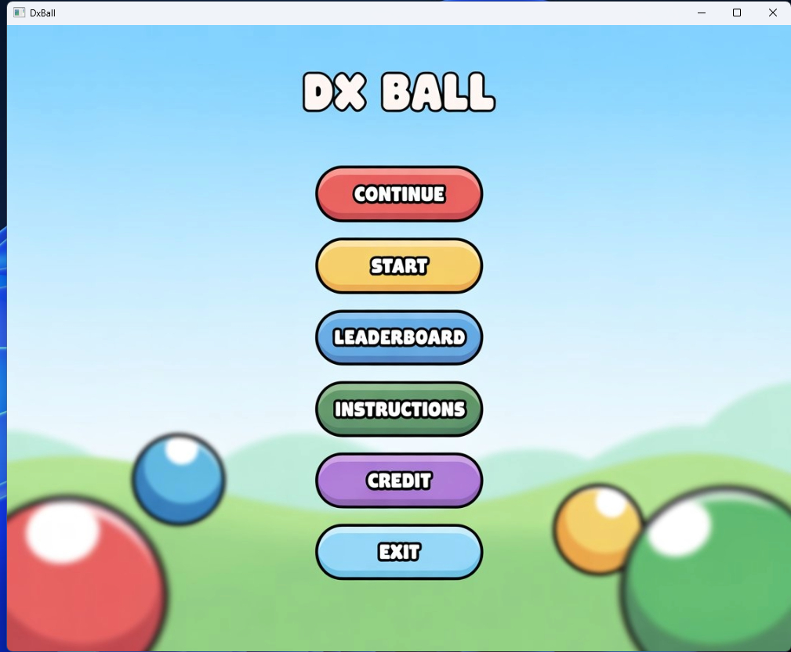
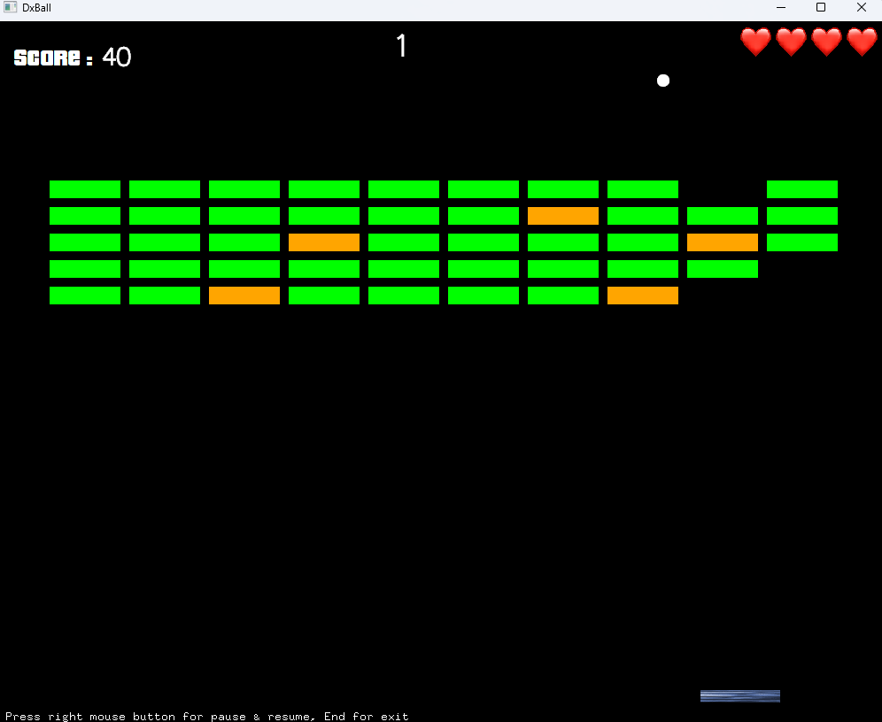
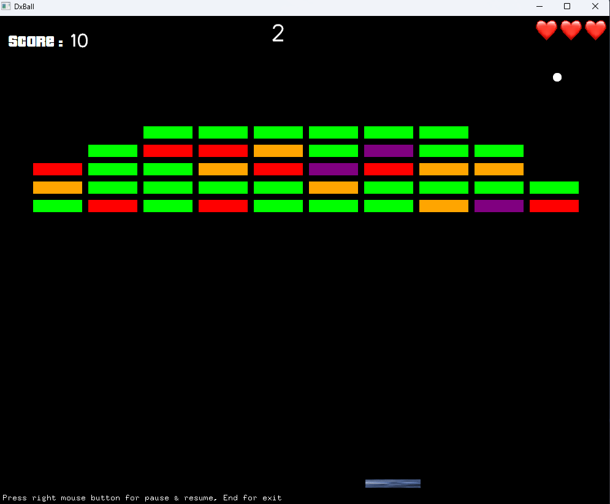
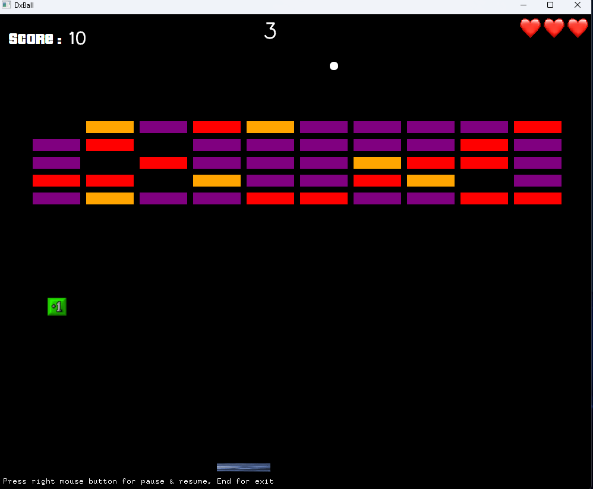
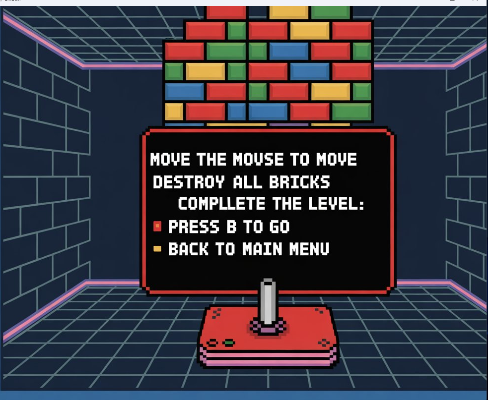
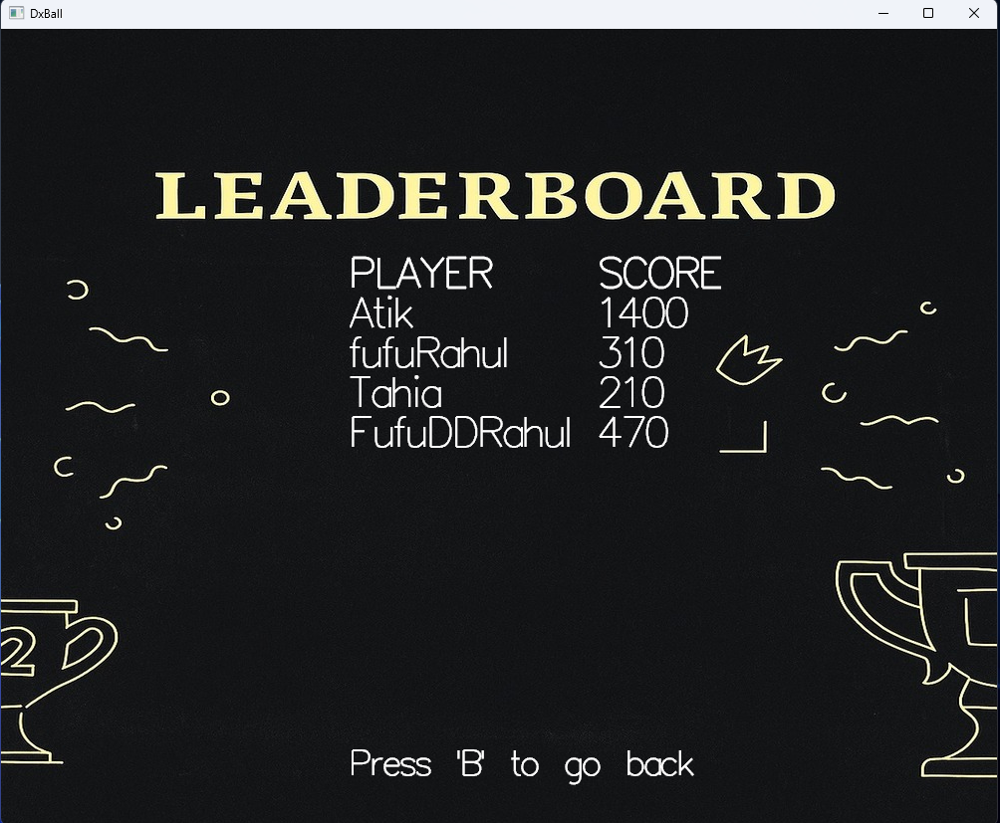
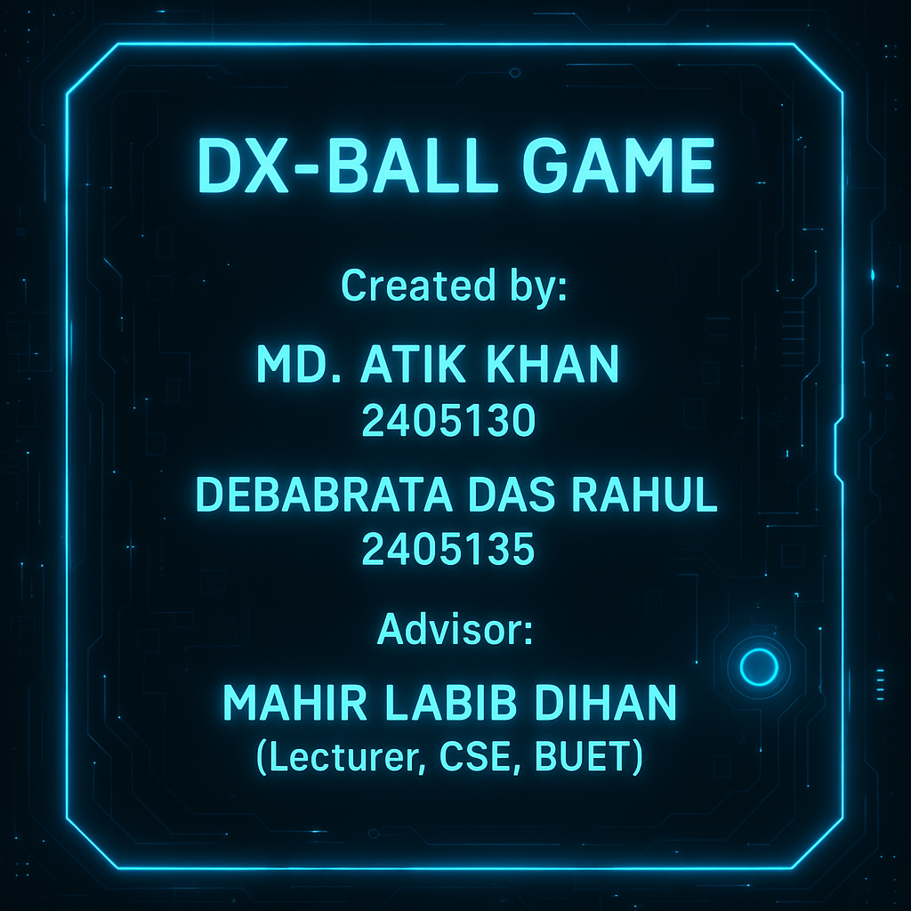

<h1> DxBall </h1>
<!-- <h2> A C++ Graphics Library for Beginners</h2> -->

This is a new version of the most popular game DxBall which is made by iGraphics. It was a given as a project in our 1-1 semester from BUET.The game has three different levels. Player has to move the paddle with the mouse,destroy all the bricks to complete all the levels. There are also 3 perks in every level to level up lives, increase ball speed etc. Special thanks to our advisor "MAHIR LABIB DIHAN" SIR for helping us in every sector building this game and also giving ideas for implementing our project.

    <a href="https://youtu.be/gV03gSGZrG8">Youtube Video</a>

    

# Main Menu

# Level 1

# Level 2

# Level 3

# Help Menu

# Leaderboard

# Credit

