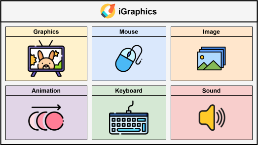
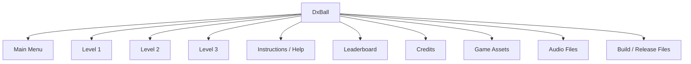
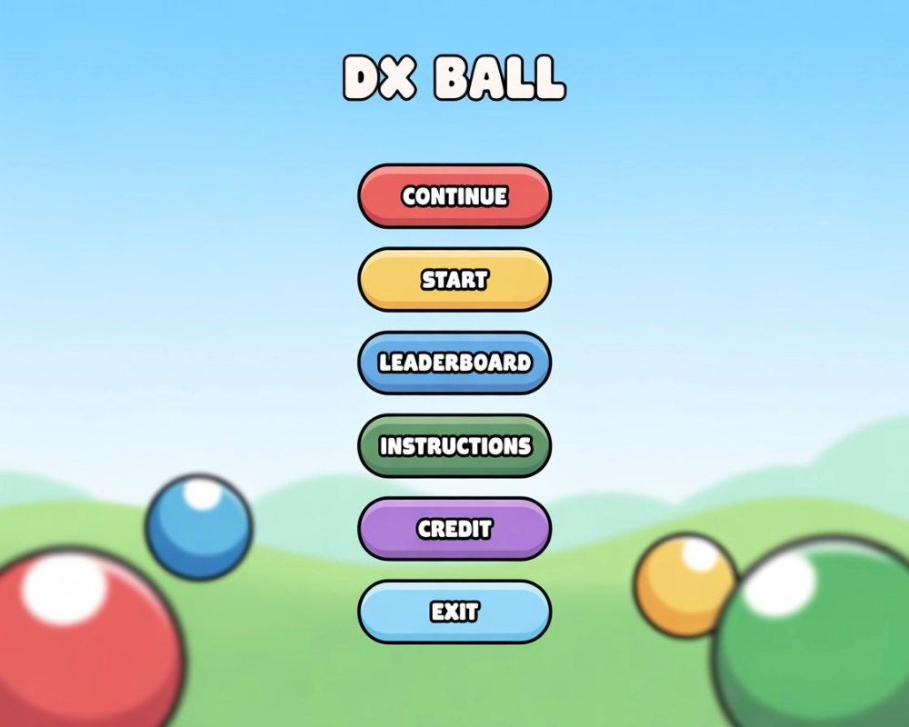
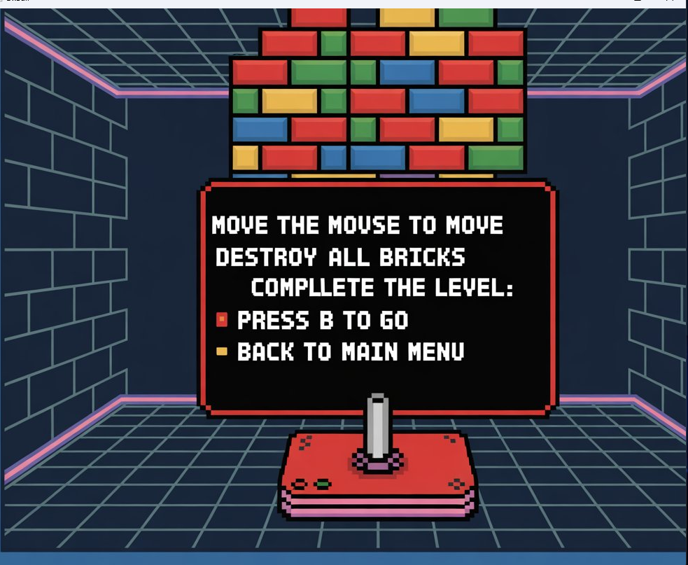
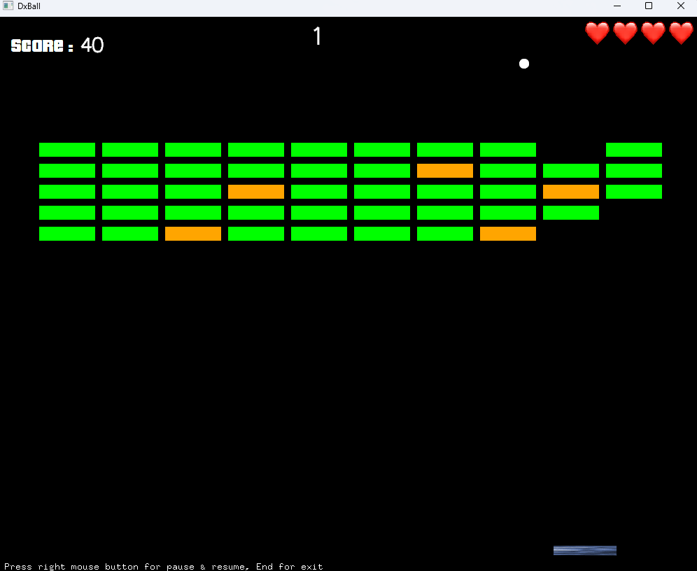
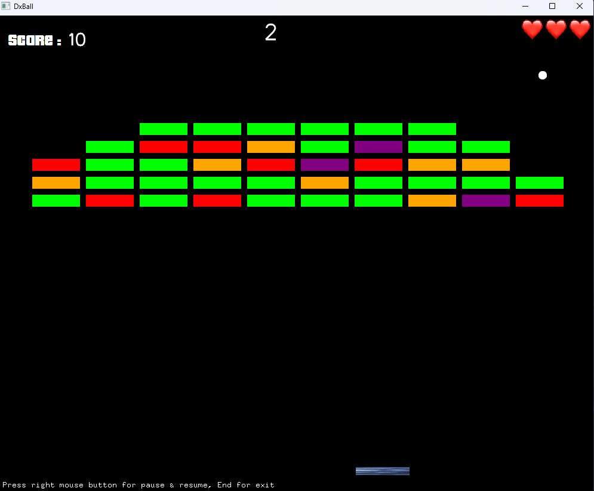
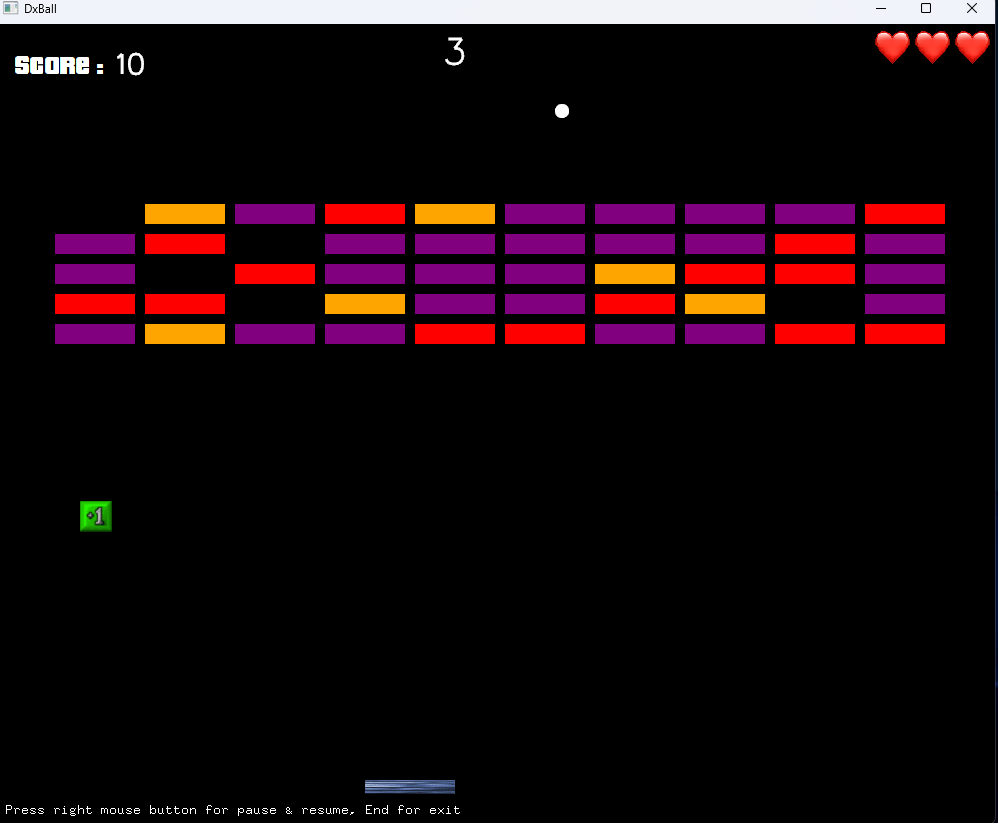
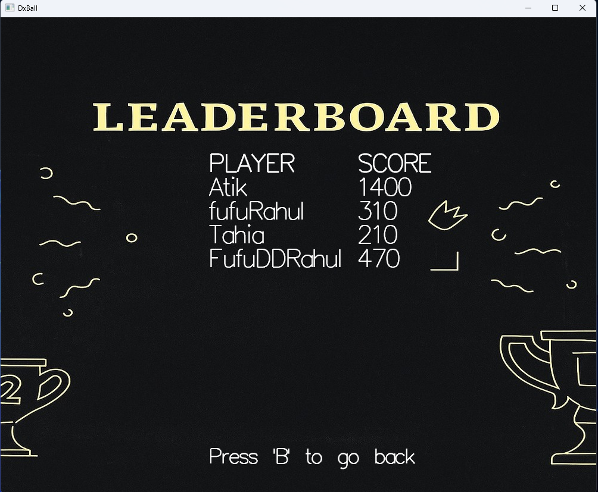
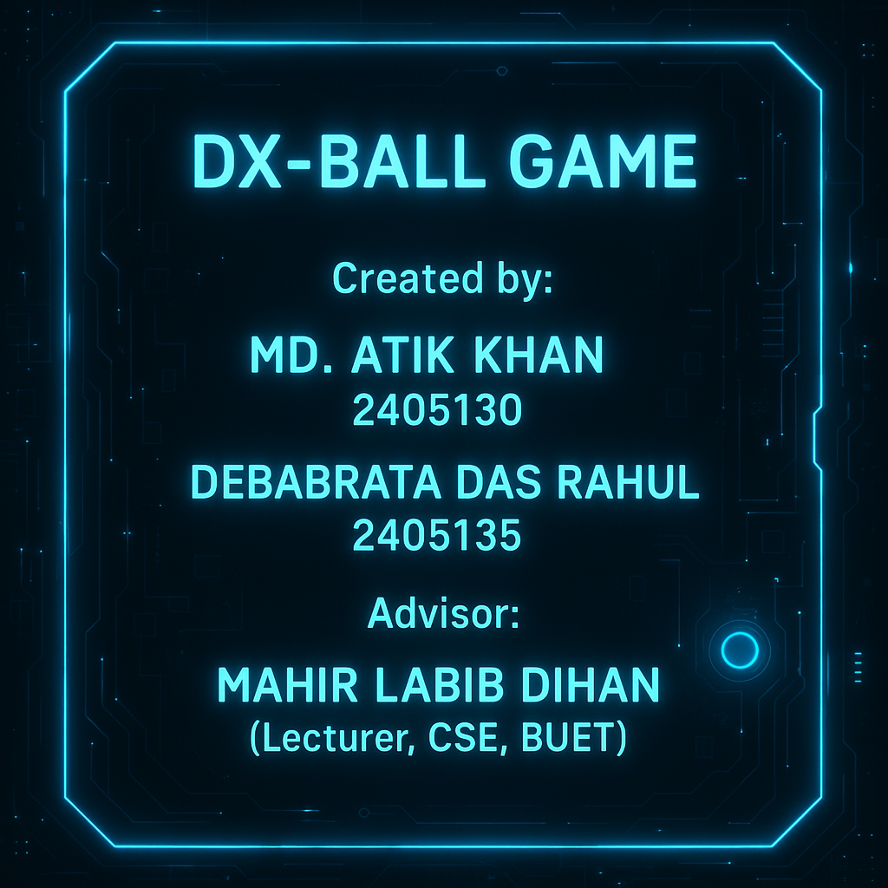
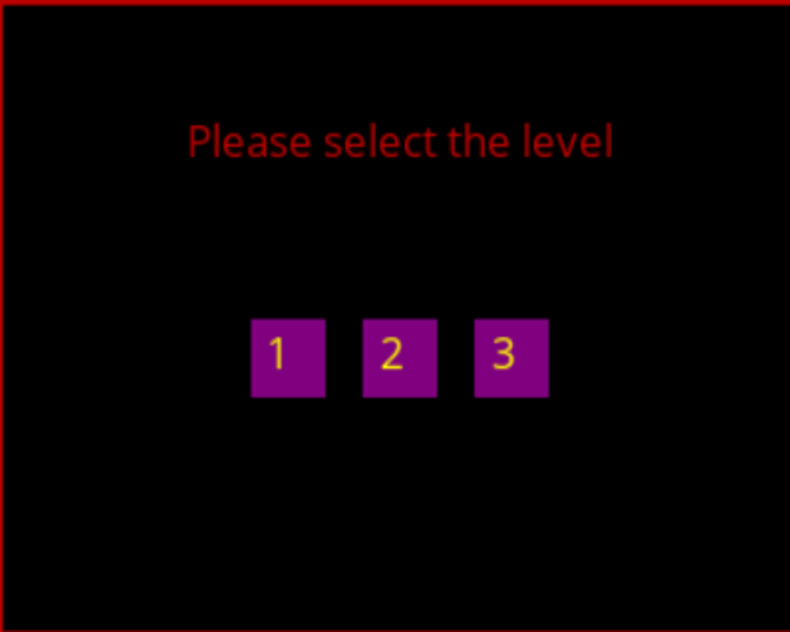

# 🎮 DxBall

**A classic arcade-style DxBall game built with iGraphics in C/C++**

  
  
  
  

---

## ✨ About the Project

**DxBall** is a polished recreation of the classic brick-breaking arcade game, developed as a BUET Level 1 Term 1 project. The game focuses on simple but engaging gameplay: move the paddle with the mouse, keep the ball in play, destroy all the bricks, and progress through three uniquely designed levels. Along the way, the game includes perks, sound effects, a leaderboard, instruction pages, and a credits screen to complete the full arcade experience.

This repository is not only a game project, but also a complete showcase of how a full C/C++ game can be organized with assets, menus, gameplay logic, and reusable resources.

---

## 🧭 Repo at a Glance

```mermaid
flowchart TD
    A[DxBall] --> B[Main Menu]
    A --> C[Level 1]
    A --> D[Level 2]
    A --> E[Level 3]
    A --> F[Instructions / Help]
    A --> G[Leaderboard]
    A --> H[Credits]
    A --> I[Game Assets]
    A --> J[Audio Files]
    A --> K[Build / Release Files]
```

---

## 🖼️ Visual Preview

<table>
  <tr>
    <td align="center"> <b>Main Menu</b></td>
    <td align="center"> <b>Instructions</b></td>
  </tr>
  <tr>
    <td align="center"> <b>Level 1</b></td>
    <td align="center"> <b>Level 2</b></td>
  </tr>
  <tr>
    <td align="center"> <b>Level 3</b></td>
    <td align="center"> <b>Leaderboard</b></td>
  </tr>
  <tr>
    <td align="center"> <b>Credits</b></td>
    <td align="center"> <b>Game Preview</b></td>
  </tr>
</table>

---

## 🎯 Key Features

- Classic brick-breaking arcade gameplay
- Three distinct levels with unique challenges
- Mouse-controlled paddle movement
- Power-ups / perks to enhance gameplay
- Score tracking and leaderboard support
- Instruction / help screen for easy onboarding
- Credits page for developer and advisor acknowledgment
- Sound effects and background music for an immersive experience

---

## 📁 Project Structure

| Folder / File | Purpose |
|---|---|
| `MINGW/` | Toolchain-related files |
| `OpenGL/` | Graphics-related support files |
| `assets/` | Game resources and supporting files |
| `demo/` | Demo-related content |
| `examples/` | Sample or example content |
| `bin/` | Build output / binary-related files |
| `obj/` | Object files generated during build |
| `release/` | Release build artifacts |
| `saves/` | Saved game / progress data |
| `iMain.cpp` | Main game source file |
| `iGraphics.h` | Graphics support header |
| `iSound.h` | Sound support header |
| `iFont.h` | Font support header |

---

## 🧩 Screens and Pages Included

### Main Menu
The entry point of the game, designed to give the player a clean and interactive start.

### Instructions / Help Page
Explains how to play the game and understand the controls.

### Level 1, Level 2, Level 3
Three progressively challenging stages that keep the gameplay engaging and dynamic.

### Leaderboard
Stores and displays player scores with names.

### Credits Page
Gives recognition to the developers and advisor involved in the project.

---

## 🔊 Audio and Assets

This project includes supporting visual and audio resources such as:

- `background.png`
- `Menu.jpg`
- `InstructionPage.png`
- `LeaderboardPage.png`
- `Level1.png`, `Level2.png`, `Level3.png`
- `Credit.jpeg`
- `Boing.wav`, `Boop.wav`, `Fall.wav`, `Wall.wav`
- `bgm1.mp3`, `level1bg.mp3`
- `score.png`, `life.png`, `paddle_M1.bmp`

These assets help build the arcade atmosphere and make the game feel complete.

---

## 🛠️ Tech Stack

- **Language:** C / C++
- **Graphics Framework:** iGraphics
- **Platform:** Windows-oriented build environment
- **Assets:** Images, sound effects, background music

---

## ▶️ How to Run

1. Open the project in a compatible C/C++ environment.
2. Make sure the required graphics and sound support files are present.
3. Build and run the `iMain.cpp` file.
4. Start the game from the main menu and play through all three levels.

---

## 🎓 Acknowledgment

This project was created as part of a BUET Level 1 Term 1 assignment. Special thanks to **MAHIR LABIB DIHAN Sir** for guidance, support, and ideas throughout the project.

---

## 📝 Short Description

A classic DxBall-style arcade game built in C/C++ with iGraphics, featuring three levels, a leaderboard, instruction pages, sound effects, and a polished visual presentation.

---

## ❤️ Final Note

This repository showcases both game development and structured project presentation. It reflects the effort behind building a complete arcade experience with visuals, audio, gameplay logic, and user-friendly screens.
